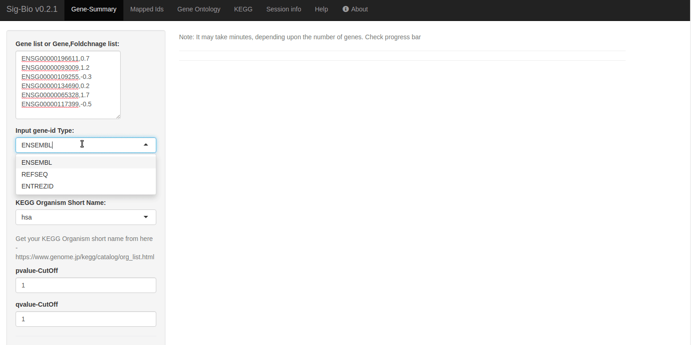

# sig-bio-shiny

<!-- badges: start -->
  [](https://www.tidyverse.org/lifecycle/#experimental)
  [](https://travis-ci.org/sk-sahu/sig-bio-shiny)
  [](https://circleci.com/gh/sk-sahu/sig-bio-shiny)
  [](https://github.com/sk-sahu/sig-bio-shiny/releases)
  [](https://hub.docker.com/repository/docker/sudosk/sig-bio-shiny/builds)
<!-- badges: end -->

An application interface for doing Significant Biology on a set of Gene

* [Demo](#demo)
* [Introduction](#introduction)
* [Disclaimer](#disclaimer)
* [Requirement](#requirements)
* [Download](#download)
* [Run the shiny app](#run-the-shiny-app)

## Demo


## Introduction
**Significant Biology** is an important step of any high-throughput sequence analysis. Once you mapped and/or assembled sequenced reads followed by feature(gene/isoform) quantification and/or diffrential analysis you will end up with set of genes. Quickly exploring those genes from diffrent aspect what gives an idea about the Biology they involved in. Here comes this **SigBio** Shiny application interface. This is platform where with a set of genes you can do **Gene mapping Annotation, Enrichment Analysis of Gene Ontology (GO), KEGG Pathway and many things (which will be discussed soon).**

Completely made using R and Bioconductor. No manual database dump required, which make deployment simple with a single R Script. It takes full advantage of AnnotationHub package to get annotation for the selected organism and do enrichment analysis on top of it using ClusterProfiler.  AnnotationHub makes sure you always get the lastest annotation from public databases. 

## Disclaimer
sig-bio-shiny shiny application along with the SigBio R package is an open source effort and distributed under [MIT license](https://opensource.org/licenses/MIT). This uses KEGG data for few tasks, which is free for Academic uses but other uses may require a license agreement (In details at [KEGG Website](https://www.kegg.jp/kegg/legal.html)). By using this application you follow the respective tool licenses. Any developer involved in this DO NOT warrant nor responsible for any legal issues.

## Requirements
R >= 3.5

## Download
First you need to install the SigBio package which have all the APIs required for most functionality in the shiny app.
```r
if (!require(remotes)) { install.packages("remotes") }
  remotes::install_github("sk-sahu/sig-bio-shiny", 
                          ref = "v0.2.2")
```

Download a specific version of the app using wget from terminal
```bash
wget https://raw.githubusercontent.com/sk-sahu/sig-bio-shiny/v0.2.2/app.R -O sig-bio-shiny-app-v0.2.2.R
```
On the first time of running This will download and install all the required dependency.

## Run the shiny app
From your terminal
```bash
Rscript sig-bio-shiny-app-v0.2.2.R
```
Access the app in your browser with output URL.

### Run with docker
```bash
docker pull sudosk/sig-bio-shiny:v0.2.2
docker run --user shiny --rm -p 80:3838 sudosk/sig-bio-shiny:v0.2.2
```
Accessed app in a browser at http://127.0.0.1
